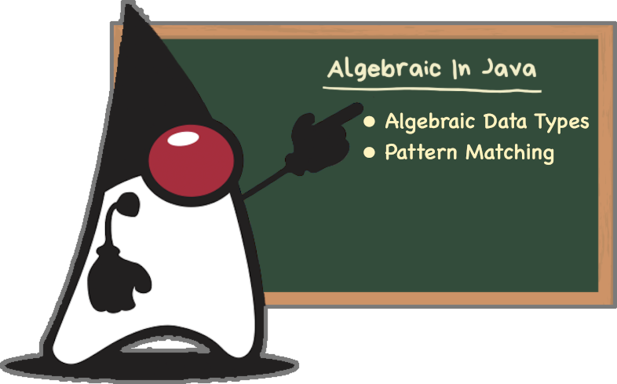

= Algebraic data types
:toc:

Algebraic data types (ADTs) were introduced in Hope, a small functional programming language developed in the 1970s at the University of Edinburgh.

*Algebraic* refers to the property that an ADT is created by algebraic operations. The algebra here, is *_sums_*, *_products_* and *_patterns_*:

*sum*:: alternation (for three values A, B, C → A or B or C but not any combination or other subset).
*product*:: combination (for three values A, B, C → A and B and C, possible to hold empty for one or more).

Algebraic data types are also known as *_composite types_* - a type formed by combining other types.

Algebraic data types (ADTs) can be identified and analyzed using *_Pattern Matching_*.

== A deeper look at Sum and Product types

Let us look at the two common types: sum types and product types.

=== Values of algebraic types

.Deeper look at the algebraic data types
[cols="3*^.^"]
|===
||Sum Types | Product Types

| Use
| Define variants
| Hold Values

| Logic
| Logical OR operation (only one of the variants is possible)
| Logical AND operation (combination of several values)

| Content
| Each variant can have its own constructor with specified number of arguments
| Contains several values of possibly different types themselves

.4+| Examples

| `Enums` (additional data cannot be associated with an enum, once created)
| `Class`

| `Optional`
| Tuple (developer created/third party libraries)

| `Sealed` types
| `Records` (Java 14,15) Java 16

|
| `Visitor`
|===

== Examples
=== Sum types

.Examples of Sum Types
|===
| Example | Description

| link:src/none/cgutils/algebraic/sum/Example1Enum.java[Example1Enum]
| Enums in Java

| link:src/none/cgutils/algebraic/sum/Example2Optional.java[Example2Optional]
| Using Optional in Java

| link:src/none/cgutils/algebraic/sum/Example3Sealed.java[Example3Sealed]
| Sealed Types in Java
|===

=== Product Types

.Examples of Product Types
|===
| Example | Description

| link:src/none/cgutils/algebraic/product/Example1Class.java[Example1Class]
| A Class in Java

| link:src/none/cgutils/algebraic/product/Example2Tuple.java[Example2Tuple]
| Tuples in Java

| link:src/none/cgutils/algebraic/product/Example3Record.java[Example3Record]
| Records in Java
|===

=== Related Patterns

.Examples of patterns used in Algebraic Java
|===
| Example | Description

| link:src/none/cgutils/algebraic/other/Example1Variance.java[Example1Variance]
| Covariance and Contravariance
| link:src/none/cgutils/algebraic/other/Example2VisitorPattern.java[Example2VisitorPattern]
| A walk-through of the visitor pattern
|===

== Project Structure
----
|____LICENSE
|____README.adoc       <----- This file
|____assets            <----- Images linked above
|____src
| |____none
| | |____cgutils
| | | |____algebraic
| | | | |____sum       <----- Examples of Sum types
| | | | |____product   <----- Examples of Product types
| | | | |____other     <----- Examples of patterns

----

== Further reading

link:https://cguntur.me/2021/01/12/algebraic-in-java-part-1/[Chandra's Blog Algebraic Data Types - Part 1]

link:https://cr.openjdk.java.net/~briangoetz/amber/datum.html[Brian Goetz's Thoughts on Datum]

link:https://cr.openjdk.java.net/~briangoetz/amber/datum_2.html[An older version of Brian Goetz's Thoughts on Datum]

link:https://en.wikipedia.org/wiki/Algebraic_data_type[Wikipedia Article on Algebraic Data Types]

link:https://cr.openjdk.java.net/~briangoetz/amber/pattern-match.html[Brian Goetz's Thoughts on Pattern Matching]

link:https://en.wikipedia.org/wiki/Pattern_matching[Wikipedia Article on Pattern Matching]

link:https://en.wikipedia.org/wiki/Catamorphism[Wikipedia Article on Catamorphism]