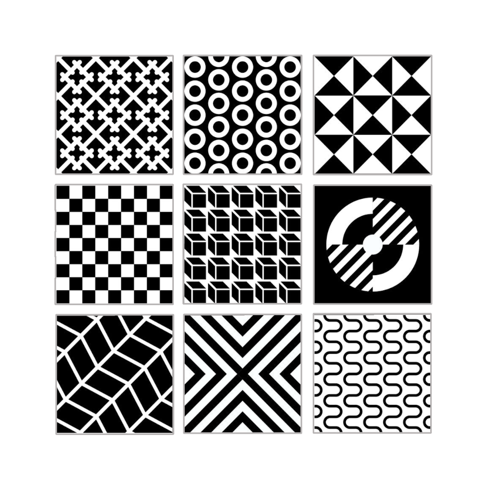

= image:../images/AlgebraicInJava.png[Duke with Green Board,65] Pattern Matching in Java

. First known usage in *SNOBOL* ("**S**tri**N**g **O**riented and sym**BO**lic **L**anguage") in the 1960s.
. The `instanceof` operator used to check the object's *Type Pattern*
. Java 16 added a feature *Pattern Matching* `instanceof`
link:https://openjdk.java.net/jeps/305[_Java 14: JEP-305_],{nbsp}  {nbsp}
link:https://openjdk.java.net/jeps/375[_Java 15: JEP-375_],{nbsp}  {nbsp}
link:https://openjdk.java.net/jeps/394[*Java 16: JEP-394*]
. Future releases of Java to potentially contain other exciting new features!

[width="100%", frame="none", grid="none", cols="4,6"]
|===
| {nbsp} | *Links*
.4+| 
| image:../images/Switch.png[Switch, 50, role="thumb"] link:patterns/switch/00_SwitchCasePatternMatching.adoc[Patterns for `switch`-`case` ▶️]
| image:../images/Record.png[Record, 50, role="thumb"] link:patterns/records/00_RecordsPatternMatching.adoc[Patterns for Records ▶️]
| image:../images/Array.png[Arrays, 50, role="thumb"] link:patterns/arrays/00_ArraysPatternMatching.adoc[Patterns for Arrays ▶️]
| image:../images/OtherDetails.png["Other Details", 50, role="thumb"] link:patterns/other/00_OtherDetails.adoc[Other Details ▶️]
|===

[caption=" ", .center, cols="<40%, ^20%, >40%", width=95%, grid=none, frame=none]
|===
| {nbsp}
| link:../../README.adoc[README 🔼]
| {nbsp}
|===
