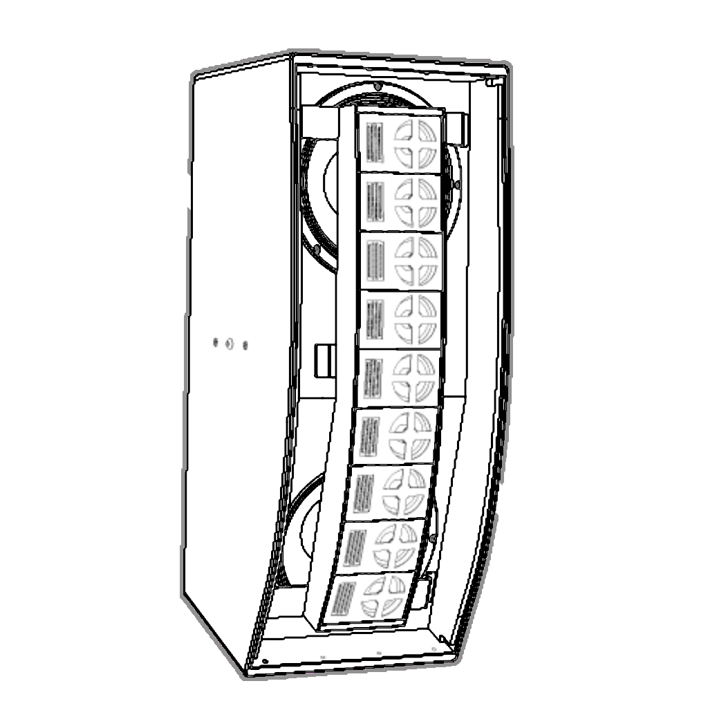

= Java `instanceof` - Pattern Matching

. The `instanceof` operator used to check the object's *Type Pattern*
. After two previews, Java 16 now has a *Pattern Matching* `instanceof`
. Future releases of Java will potentially contain other exciting new features!
. Some proposed features include: +
 +
image:../images/Switch.png[Switch, 50] link:patterns/switch/SwitchPatterns.adoc[`instanceof` in `switch`-`case` statements ▶️]  +
 +
 link:patterns/arrays/ArraysPatterns.adoc[`instanceof` for Arrays ▶️] +
 +
image:../images/Record.png[Record, 50] link:patterns/records/RecordsPatterns.adoc[`instanceof` for Records ▶️]

[caption=" ", .center, cols="<50%, >50%", width=95%, grid=none, frame=none]
|===
|  {nbsp} | {nbsp}
|===
