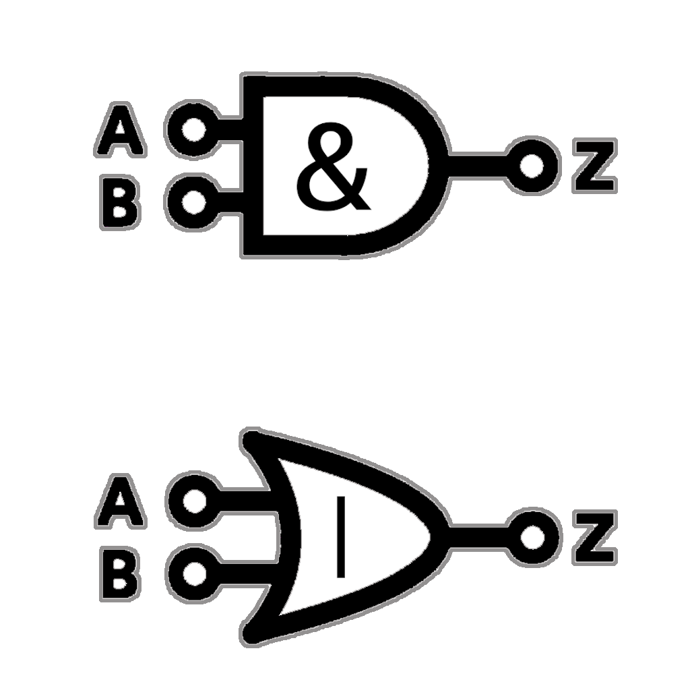

=  Algebraic Data Types

The algebra covered here, is *_sums_* and *_products_*:

*sum*: _alternation_ (for three values *A*, *B*, *C* → A *or* B *or* C but _not any combination or other subset_).

*product*: _combination_ (for three values *A*, *B*, *C* → A *and* B *and* C, _possible to hold empty for one or more_).

== Values of algebraic types
[cols="3*^.^"]
|===
||Sum Types | Product Types

| Use
| Define variants
| Hold Values

| Logic
| Logical OR operation (only one of the variants is possible)
| Logical AND operation (combination of several values)

| Content
| Each variant can have its own constructor with specified number of arguments
| Contains several values of possibly different types themselves
|===

[caption=" ", .center, cols="<40%, ^20%, >40%", width=95%, grid=none, frame=none]
|===
| {nbsp}
| link:../AlgebraicDataTypes.adoc[ADTs 🔼]
| link:02_TabulatedExamples.adoc[Tabulated Examples ▶️]
|===
