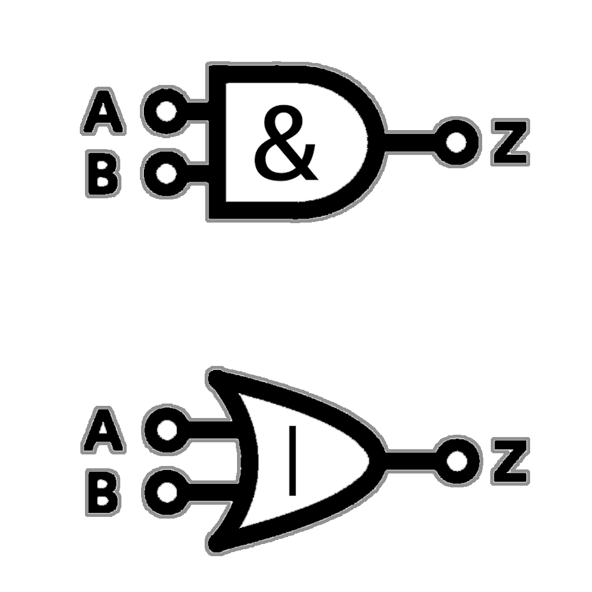

=  Tabulated Examples

.Examples of Sum Types
|===
| Example | Description

| link:../../../src/none/cgutils/algebraic/sum/Example1Enum.java[Example1Enum]
| *Enums* in Java

| link:../../../src/none/cgutils/algebraic/sum/Example2Optional.java[Example2Optional]
| Using *Optional* in Java

| link:../../../src/none/cgutils/algebraic/sum/Example3Sealed.java[Example3Sealed]
| *Sealed Types* in Java
|===

.Examples of Product Types
|===
| Example | Description

| link:../../../src/none/cgutils/algebraic/product/Example1Class.java[Example1Class]
| A *Class* in Java

| link:../../../src/none/cgutils/algebraic/product/Example2Tuple.java[Example2Tuple]
| *Tuples* in Java

| link:../../../src/none/cgutils/algebraic/product/Example3Record.java[Example3Record]
| *Records* in Java
|===

[caption=" ", .center, cols="<40%, ^20%, >40%", width=95%, grid=none, frame=none]
|===
| link:01_SumAndProductTypes.adoc[◀️ Sum And Product Types]
| link:../AlgebraicDataTypes.adoc[ADTs 🔼]
| link:03_FurtherReading.adoc[Further Reading ▶️]
|===
