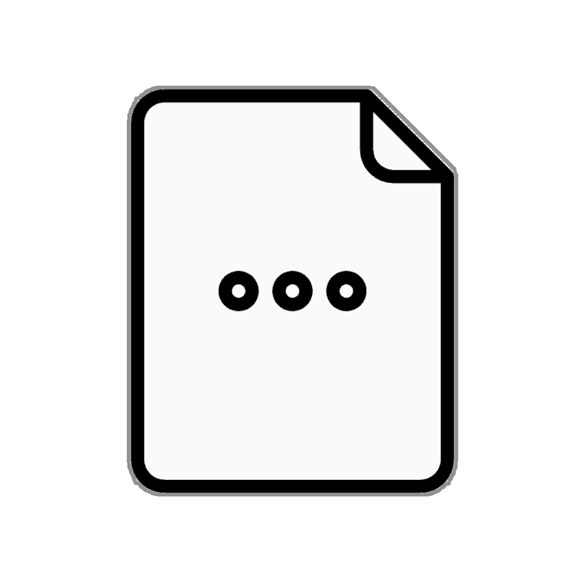

=  Named Arrays and Record Patterns
:icons: font

* Record and array patterns provide a way to deconstruct the value +
{nbsp}{nbsp}{nbsp}{nbsp} - they do not *_yet_* provide a means to also name the value being deconstructed.

* Some languages introduce a new pattern form, commonly referred to as an *as pattern* +
{nbsp}{nbsp}{nbsp}{nbsp} - specifically to allow a value being deconstructed to be named.

* There _may_ be a future addition of a similar feature in Java.

[caption=" ", .center, cols="<40%, ^20%, >40%", width=95%, grid=none, frame=none]
|===
| {nbsp}
| link:00_OtherDetails.adoc[Other Details 🔼]
| link:02_DontCarePattern.adoc[Don't Care Patterns ▶️]
|===
