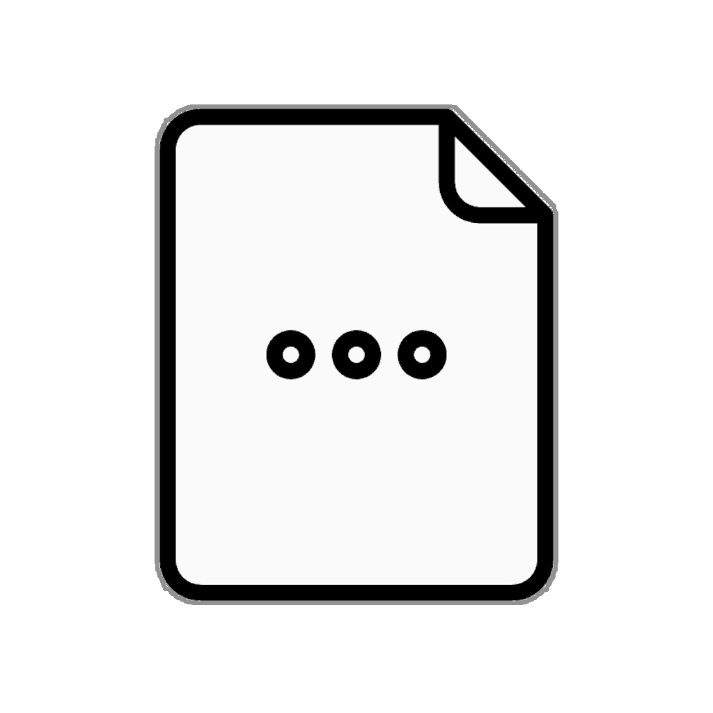

=  Deconstruction Patterns
:icons: font

* Record patterns disaggregate the values of a record type.

* It _may_ be possible to eventually to support this feature for all classes, not just record classes.

* Such general disaggregation is termed as *deconstruction*, to suggest its duality with the process of construction.

* For a general class this will possibly require the explicit declaration of a deconstruction pattern to describe how an instance of the class can be deconstructed.

[caption=" ", .center, cols="<40%, ^20%, >40%", width=95%, grid=none, frame=none]
|===
| link:03_EnhancedArrayPattern.adoc[◀️ Enhanced Array Patterns]
| link:00_OtherDetails.adoc[Other Details 🔼]
| {nbsp}
|===

