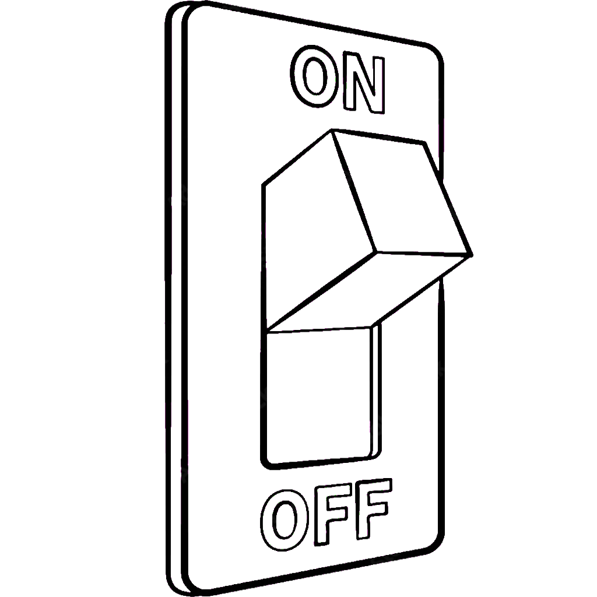

=  Switch-Case Pattern Matching
:icons: font

* Introduces type pattern checking in `case` labels

[source, java, line, linenums, highlight=2..7]
----
    static String formatterPatternSwitch(Object obj) {
        return switch (obj) {                                   // <1>
            case Integer i -> String.format("int %d", i);
            case Long l    -> String.format("long %d", l);
            case Double d  -> String.format("double %f", d);
            case String s  -> String.format("String %s", s);
            default        -> o.toString();
        };
    }
----
<1> The `case` label with a pattern matches the value of the selector-expression `obj` if the value matches the pattern.

[caption=" ", .center, cols="<40%, ^20%, >40%", width=95%, grid=none, frame=none]
|===
| {nbsp}
a| link:../../Patterns.adoc[Patterns 🔼]
a| link:SwitchPatternNull.adoc[Switch-Case Null Pattern Matching ▶️]
|===

